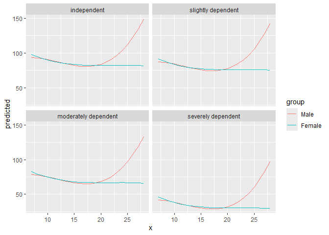
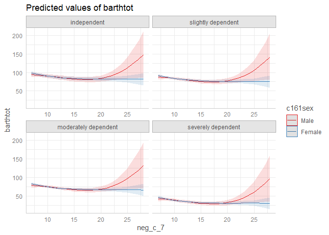
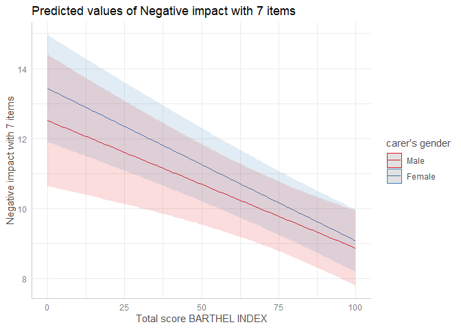

# ggeffects - Estimated Marginal Means and Adjusted Predictions from Regression Models

[](https://doi.org/10.21105/joss.00772)
[](https://strengejacke.github.io/ggeffects/)
[](https://cranlogs.r-pkg.org/)
[](https://cranlogs.r-pkg.org/)

Lüdecke D (2018). *ggeffects: Tidy Data Frames of Marginal Effects from
Regression Models.* Journal of Open Source Software, 3(26), 772. doi:
[10.21105/joss.00772](https://doi.org/10.21105/joss.00772)

## Why do we need (marginal/conditional) effects or (adjusted) predicted values?

After fitting a model, it is useful generate model-based estimates
(expected values, or *adjusted predictions*) of the response variable
for different combinations of predictor values. Such estimates can be
used to make inferences about relationships between variables.

*Adjusted predictions* or *marginal means* are often easier to
understand than raw regression coefficients. In particular, their
visualization allows to intuitively get the idea of how predictors and
outcome are associated, even for complex models.

## Aims of this package

**ggeffects** is a light-weight package that aims at easily calculating
adjusted predictions and estimated marginal means at meaningful values
of covariates from statistical models. Furthermore, it is possible to
compute contrasts or pairwise comparisons, to test predictions and
differences in predictions for statistical significance. Finally, you
can easily produce nice figures to visualize the results.

What you basically would need for your workflow is:

- `predict_response()` (understand your results)
- `test_predictions()` (check for “significant” results)
- `plot()` (communicate your results)

Three core ideas describe the philosophy of the function design and help
users to achieve the above mentioned goals:

1)  Functions are type-safe and always return a data frame with the
    same, consistent structure;

2)  there is a simple, unique approach to calculate adjusted predictions
    and estimated marginal means for many different models;

3)  the package supports “labelled data” (Lüdecke 2018), which allows
    human readable annotations for graphical outputs.

This means, users do not need to care about any expensive steps after
modeling to visualize the results. The returned as data frame is ready
to use with the **ggplot2**-package, however, there is also a
`plot()`-method to easily create publication-ready figures.

Adjusted predictions or estimated marginal means are always calculated
on the *response* scale, which is the easiest and most intuitive scale
to interpret the results.

It is easy to start, you just need one function: `predict_response()`,
and two arguments: the model and the “focal terms”, i.e. the predictors
that you are mainly interested in. Examples are shown below.

## So, when do I need the *ggeffects* package?

You should use *ggeffects*…

- … when you want to understand how predictors and outcome are related,
  no matter whether you have simple or complex models, interaction or
  transformed terms. See how to start [in this
  vignette](https://strengejacke.github.io/ggeffects/articles/ggeffects.html).
  The syntax for the *ggeffects* functions is super easy and consistent
  across the different type of models and complexity.

- … when you want to perform pairwise comparisons, in order to see
  whether there are statistically significant differences in the
  association of, for instance, different groups or categories of your
  predictors and your outcome (“effects”, or sometimes “marginal
  effects”). There are several vignettes describing this in detail,
  starting [with this
  vignette](https://strengejacke.github.io/ggeffects/articles/introduction_comparisons_1.html).

- … when you need impressive figures instead of long, confusing tables
  to describe your results. There are several examples in the
  [documentation](https://strengejacke.github.io/ggeffects/), for
  example [this
  vignette](https://strengejacke.github.io/ggeffects/articles/introduction_plotmethod.html).

- … and even when you want to check, whether your model appropriately
  describes your data. See [this
  vignette](https://strengejacke.github.io/ggeffects/articles/introduction_partial_residuals.html)
  to learn more about how to use *ggeffects* for model diagnostics.

A workflow in R would then include using following functions in this
order: `predict_response()`, `plot()`, and `test_predictions()` - that’s
all you need! See also [this example
workflow](https://strengejacke.github.io/ggeffects/articles/practical_glm_workflow.html)
using logistic regression.

## Installation

[](https://cran.r-project.org/package=ggeffects)
[](https://strengejacke.r-universe.dev)

| Type        | Source       | Command                                                                        |
|-------------|--------------|--------------------------------------------------------------------------------|
| Release     | CRAN         | `install.packages("ggeffects")`                                                |
| Development | r - universe | `install.packages("ggeffects", repos = "https://strengejacke.r-universe.dev")` |
| Development | GitHub       | `remotes::install_github("strengejacke/ggeffects")`                            |

Or you can run
[`ggeffects::install_latest()`](https://strengejacke.github.io/ggeffects/reference/install_latest.html)
to install the latest development version from r-universe.

## Adjusted predictions at…: marginalizing over non-focal predictors

`predict_response()` is a wrapper around three “workhorse” functions,
`ggpredict()`, `ggemmeans()` and `ggaverage()`. Depending on the value
of the `margin` argument, `predict_response()` calls one of those
functions, with different arguments. It’s important to note that:

1.  Predictions are always returned on the *response scale*, no matter
    which model is used. This is the most intuitive scale to interpret
    your results (the predicted values).

2.  The response is predicted at the values or levels of your *focal
    terms*, i.e. you specify the predictors you are mainly interested
    in, using the `terms` argument. The predicted values are calculated
    for these values, while all other predictors are marginalized over.

The `margin` argument in `predict_response()` indicates how to
marginalize over the *non-focal* predictors, i.e. those variables that
are *not* specified in `terms`. Each option answers slightly different
questions. Possible values are:

- `"mean_reference"` and `"mean_mode"`: `"mean_reference"` calls
  `ggpredict()`, i.e. non-focal predictors are set to their mean
  (numeric variables), reference level (factors), or “most common” value
  (mode) in case of character vectors. `"mean_mode"` calls
  `ggpredict(typical = c(numeric = "mean", factor = "mode"))`,
  i.e. non-focal predictors are set to their mean (numeric variables) or
  mode (factors, or “most common” value in case of character vectors).

  Question answered: “What is the predicted value of the response at
  meaningful values or levels of my focal terms for a ‘typical’
  observation in my data?”, where ‘typical’ refers to certain
  characteristics of the remaining predictors.

- `"marginalmeans"`: calls `ggemmeans()`, i.e. non-focal predictors are
  set to their mean (numeric variables) or marginalized over the levels
  or “values” for factors and character vectors. Marginalizing over the
  factor levels of non-focal terms computes a kind of “weighted average”
  for the values at which these terms are hold constant.

  Question answered: “What is the predicted value of the response at
  meaningful values or levels of my focal terms for an ‘average’
  observation in my data?”. It refers to randomly picking a subject of
  your sample and the result you get on average.

- `"empirical"` (or `"counterfactual"`): calls `ggaverage()`,
  i.e. non-focal predictors are marginalized over the observations in
  your sample. The response is predicted for each subject in the data
  and predicted values are then averaged across all subjects,
  aggregated/grouped by the focal terms. Averaging is applied to
  “counterfactual” predictions (Dickerman and Hernán 2020). There is a
  more detailed description in [this
  vignette](https://strengejacke.github.io/ggeffects/articles/technical_differencepredictemmeans.html).

  Question answered: “What is the predicted value of the response at
  meaningful values or levels of my focal terms for the ‘average’
  observation in the population?”. It does not only refer to the actual
  data in your sample, but also “what would be if” we had more data, or
  if we had data from a different population.

**And what about marginal effects?** Marginal effects refer to the
difference between two adjacent predictions. They are not the same as
marginal means or adjusted predictions. However, calculating contrasts
or pairwise comparisons with `test_predictions()` can be used to test
for differences in predictions (aka marginal effects).

Here’s an example:

``` r
library(ggeffects)
library(marginaleffects)
m <- lm(Petal.Width ~ Petal.Length + Species, data = iris)

# we want the marginal effects for "Species". We can calculate
# the marginal effect using the "marginaleffects" package
marginaleffects::avg_slopes(m, variables = "Species")
#> 
#>     Term            Contrast Estimate Std. Error    z Pr(>|z|)    S 2.5 %
#>  Species versicolor - setosa    0.435      0.103 4.23   <0.001 15.4 0.234
#>  Species virginica - setosa     0.838      0.145 5.76   <0.001 26.9 0.553
#>  97.5 %
#>   0.637
#>   1.123
#> 
#> Columns: term, contrast, estimate, std.error, statistic, p.value, s.value, conf.low, conf.high 
#> Type:  response

# here we show that marginal effects refer to the difference between
# predictions for a one-unit change of "Species"
out <- predict_response(m, "Species", margin = "empirical")
out
#> # Average predicted values of Petal.Width
#> 
#> Species    | Predicted |     95% CI
#> -----------------------------------
#> setosa     |      0.77 | 0.61, 0.94
#> versicolor |      1.21 | 1.15, 1.27
#> virginica  |      1.61 | 1.48, 1.74

# marginal effects of "versicolor", relative to "setosa"
out$predicted[2] - out$predicted[1]
#> [1] 0.44
# marginal effects of "virginica", relative to "setosa"
out$predicted[3] - out$predicted[1]
#> [1] 0.84

# finally, test_predictions() returns the same. while the previous results
# report the marginal effect compared to the reference level "setosa",
# test_predictions() returns the marginal effects for all pairwise comparisons
test_predictions(m, "Species")
#> # Pairwise comparisons
#> 
#> Species              | Contrast |       95% CI |      p
#> -------------------------------------------------------
#> setosa-versicolor    |    -0.44 | -0.64, -0.23 | < .001
#> setosa-virginica     |    -0.84 | -1.12, -0.55 | < .001
#> versicolor-virginica |    -0.40 | -0.52, -0.29 | < .001
```

## Documentation and Support

Please visit <https://strengejacke.github.io/ggeffects/> for
documentation and vignettes. For questions about the functionality, you
may either contact me via email or also file an issue.

## ggeffects supports many different models and is easy to use

Adjusted predictions can be calculated for many different models.
Currently supported model-objects are: averaging, bamlss, bayesx,
betabin, betareg, bglmer, bigglm, biglm, blmer, bracl, brglm, brmsfit,
brmultinom, cgam, cgamm, clm, clm2, clmm, coxph, feglm, fixest, flac,
flic, gam, Gam, gamlss, gamm, gamm4, gee, geeglm, glimML, glm, glm.nb,
glmer.nb, glmerMod, glmmPQL, glmmTMB, glmrob, glmRob, glmx, gls, hurdle,
ivreg, lm, lm_robust, lme, lmerMod, lmrob, lmRob, logistf, logitr, lrm,
mblogit, mclogit, MCMCglmm, merModLmerTest, MixMod, mixor, mlogit,
multinom, negbin, nestedLogit, nlmerMod, ols, orm, phyloglm, phylolm,
plm, polr, rlm, rlmerMod, rq, rqs, rqss, sdmTMB, speedglm, speedlm,
stanreg, survreg, svyglm, svyglm.nb, tidymodels, tobit, truncreg, vgam,
vglm, wblm, wbm, Zelig-relogit, zeroinfl, zerotrunc.

Support for models varies by marginalization method (the `margin`
argument), i.e. although `predict_response()` supports most models, some
models are only supported exclusively by one of the four downstream
functions (`ggpredict()`, `ggemmeans()`, `ggeffect()` or `ggaverage()`).
This means that not all models work for every `margin` option of
`predict_response()`. Other models not listed here might work as well,
but are currently not tested.

Interaction terms, splines and polynomial terms are also supported.
There is a generic `plot()`-method to plot the results using
**ggplot2**.

## Examples

The returned data frames always have the same, consistent structure and
column names, so it’s easy to create ggplot-plots without the need to
re-write the function call. `x` and `predicted` are the values for the
x- and y-axis. `conf.low` and `conf.high` could be used as `ymin` and
`ymax` aesthetics for ribbons to add confidence bands to the plot.
`group` can be used as grouping-aesthetics, or for faceting.

`predict_response()` requires at least one, but not more than four terms
specified in the `terms`-argument. Predicted values of the response,
along the values of the first term are calculated, optionally grouped by
the other terms specified in `terms`.

### Adjusted predictions for one focal predictor

``` r
library(ggeffects)
library(splines)
library(datawizard)
data(efc, package = "ggeffects")
efc <- to_factor(efc, c("c161sex", "e42dep"))
fit <- lm(barthtot ~ c12hour + bs(neg_c_7) * c161sex + e42dep, data = efc)

predict_response(fit, terms = "c12hour")
#> # Predicted values of barthtot
#> 
#> c12hour | Predicted |       95% CI
#> ----------------------------------
#>       4 |     89.91 | 84.18, 95.63
#>      12 |     89.34 | 83.62, 95.06
#>      22 |     88.63 | 82.90, 94.36
#>      36 |     87.64 | 81.88, 93.40
#>      49 |     86.72 | 80.90, 92.53
#>      70 |     85.23 | 79.30, 91.16
#>     100 |     83.10 | 76.92, 89.29
#>     168 |     78.28 | 71.24, 85.33
#> 
#> Adjusted for:
#> * neg_c_7 =       11.83
#> * c161sex =        Male
#> *  e42dep = independent
```

A possible call to ggplot could look like this:

``` r
library(ggplot2)
mydf <- predict_response(fit, terms = "c12hour")
ggplot(mydf, aes(x, predicted)) +
  geom_line() +
  geom_ribbon(aes(ymin = conf.low, ymax = conf.high), alpha = 0.1)
```

<!-- -->

However, there is also a `plot()`-method. This method uses convenient
defaults, to easily create the most suitable plot for the predictions.

``` r
mydf <- predict_response(fit, terms = "c12hour")
plot(mydf)
```

<!-- -->

### Adjusted predictions for several focal predictors

With three variables, predictions can be grouped and faceted.

``` r
result <- predict_response(fit, terms = c("neg_c_7", "c161sex", "e42dep"))
# we want a more compact table, thus we use `print()` explicitly
print(result, collapse_table = TRUE, collapse_ci = TRUE)
#> # Predicted values of barthtot
#> 
#> neg_c_7 | c161sex |               e42dep |     Predicted (95% CI)
#> -----------------------------------------------------------------
#>       7 |    Male |          independent |  93.73 (87.01, 100.44)
#>      12 |         |                      |  86.89 (81.09,  92.70)
#>      17 |         |                      |  80.62 (73.69,  87.54)
#>      28 |         |                      | 148.54 (85.66, 211.42)
#>       7 |         |   slightly dependent |  87.41 (81.27,  93.56)
#>      12 |         |                      |  80.58 (76.32,  84.84)
#>      17 |         |                      |  74.31 (68.46,  80.15)
#>      28 |         |                      | 142.23 (79.71, 204.75)
#>       7 |         | moderately dependent |  78.29 (72.08,  84.49)
#>      12 |         |                      |  71.46 (67.64,  75.27)
#>      17 |         |                      |  65.18 (59.75,  70.60)
#>      28 |         |                      | 133.10 (70.44, 195.76)
#>       7 |         |   severely dependent |  41.93 (35.66,  48.21)
#>      12 |         |                      |  35.10 (30.98,  39.22)
#>      17 |         |                      |  28.82 (23.41,  34.24)
#>      28 |         |                      |  96.75 (34.08, 159.41)
#>       7 |  Female |          independent |  98.04 (93.06, 103.02)
#>      12 |         |                      |  86.61 (81.85,  91.37)
#>      17 |         |                      |  82.58 (77.33,  87.82)
#>      28 |         |                      |  81.57 (64.41,  98.73)
#>       7 |         |   slightly dependent |  91.73 (87.89,  95.57)
#>      12 |         |                      |  80.30 (77.43,  83.17)
#>      17 |         |                      |  76.26 (72.57,  79.96)
#>      28 |         |                      |  75.26 (58.64,  91.87)
#>       7 |         | moderately dependent |  82.60 (78.62,  86.59)
#>      12 |         |                      |  71.17 (68.79,  73.56)
#>      17 |         |                      |  67.14 (63.95,  70.33)
#>      28 |         |                      |  66.13 (49.52,  82.74)
#>       7 |         |   severely dependent |  46.25 (41.93,  50.57)
#>      12 |         |                      |  34.82 (32.27,  37.37)
#>      17 |         |                      |  30.78 (27.67,  33.90)
#>      28 |         |                      |  29.78 (13.33,  46.23)
#> 
#> Adjusted for:
#> * c12hour = 42.10

ggplot(result, aes(x = x, y = predicted, colour = group)) +
  geom_line() +
  facet_wrap(~facet)
```

<!-- -->

`plot()` works for this case, as well:

``` r
plot(result)
```

<!-- -->

### Contrasts and pairwise comparisons

Next, an example of an interaction term. We want to know whether the two
slopes are significantly different from each other.

``` r
fit <- lm(neg_c_7 ~ c12hour + barthtot * c161sex + e42dep, data = efc)
result <- predict_response(fit, c("barthtot", "c161sex"))
plot(result)
```

<!-- -->

This can be achieved by `test_predictions()`.

``` r
test_predictions(result)
#> # (Average) Linear trend for barthtot
#> 
#> c161sex     | Contrast |      95% CI |     p
#> --------------------------------------------
#> Male-Female |     0.01 | -0.01, 0.03 | 0.466
```

We can conclude that slopes (or “linear trends”) of `barthtot` for the
different groups of `c161sex` are not statistically significantly
different from each other.

More features are explained in detail in the
[package-vignettes](https://strengejacke.github.io/ggeffects/).

## Citation

In case you want / have to cite my package, please use
`citation('ggeffects')` for citation information:

Lüdecke D (2018). *ggeffects: Tidy Data Frames of Marginal Effects from
Regression Models.* Journal of Open Source Software, 3(26), 772. doi:
[10.21105/joss.00772](https://doi.org/10.21105/joss.00772)

## References

<div id="refs" class="references csl-bib-body hanging-indent"
entry-spacing="0">

<div id="ref-dickerman_counterfactual_2020" class="csl-entry">

Dickerman, Barbra A., and Miguel A. Hernán. 2020. “Counterfactual
Prediction Is Not Only for Causal Inference.” *European Journal of
Epidemiology* 35 (7): 615–17.
<https://doi.org/10.1007/s10654-020-00659-8>.

</div>

<div id="ref-daniel_ludecke_2018_1249216" class="csl-entry">

Lüdecke, Daniel. 2018. “Sjlabelled: Labelled Data Utility Functions,”
May. <https://doi.org/10.5281/zenodo.1249215>.

</div>

</div>
